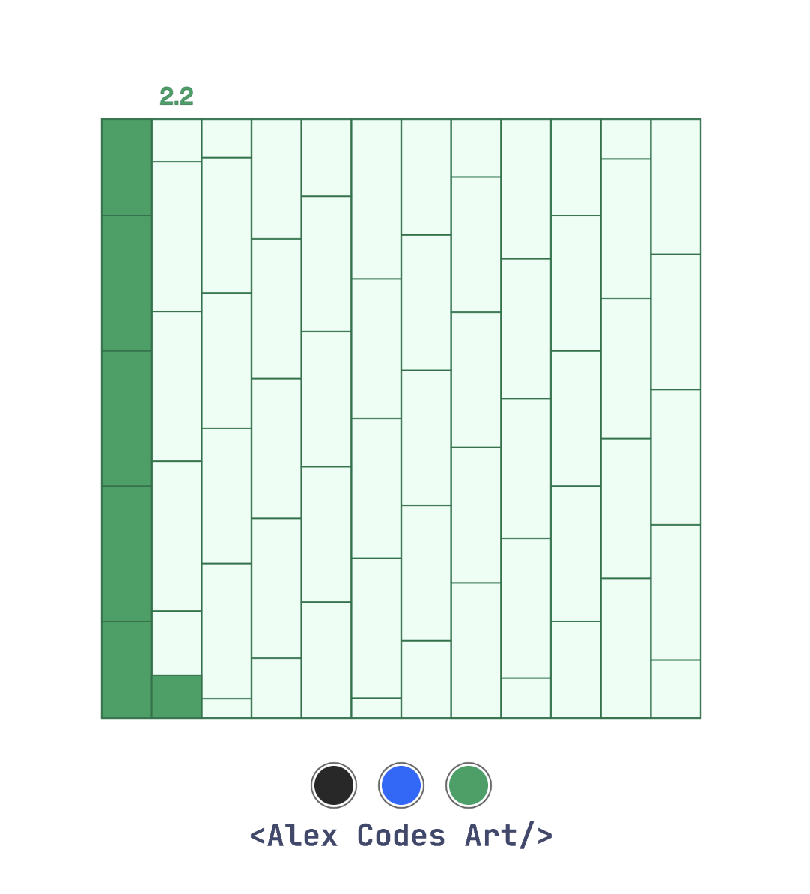

# Year Progress Calendar

A visual calendar that shows the progress of the current year through filled months and the current month's progress. Perfect for embedding in websites or dashboards to display year progression in an elegant, minimalist way.



## Description

This calendar displays:
- All 12 months of the year in a grid
- Past months filled to show completion
- Current month partially filled based on the current day
- Optional week divisions
- Optional day divisions
- Current date display
- Customizable color schemes

## Embedding

To embed this calendar in your website, include the following HTML:

```html
<iframe
src="https://path-to-your-calendar/index.html"
width="600"
height="600"
frameborder="0">
</iframe>
```

## URL Parameters

You can customize the calendar's appearance and behavior using URL parameters:

### Color Schemes
`color`: Sets the color scheme of the calendar
- Values: `black`, `blue`, `green`
- Default: `black`
- Example: `?color=blue`

### UI Visibility
`showUI`: Controls the visibility of UI elements (color buttons, tweakpane controls, logo)
- Values: `true`, `false`
- Default: `true`
- Example: `?showUI=false`

### Week Lines
`showWeeks`: Controls the visibility of week division lines
- Values: `true`, `false`
- Default: `true`
- Example: `?showWeeks=false`

### Day Lines
`showDays`: Controls the visibility of day division lines
- Values: `true`, `false`
- Default: `false`
- Example: `?showDays=true`


## Dependencies

This project uses:
- p5.js for rendering
- Tweakpane for UI controls (when enabled)

## Notes

- The calendar automatically updates based on the current date
- The canvas size is fixed at 600x600 pixels
- When UI is hidden, the calendar becomes a pure display element
- Color schemes are carefully chosen for optimal visibility and aesthetics